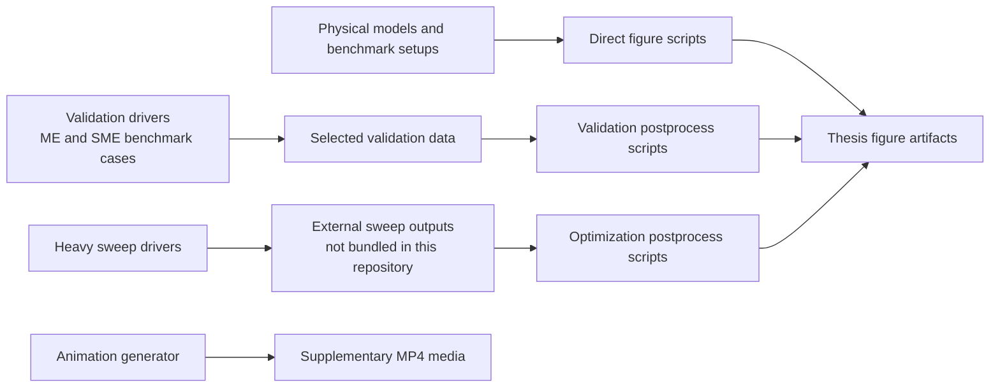

# Qubit Readout Repo

This repository is being shared with **Unitary Foundation grant reviewers** together with a single accompanying PDF containing **Chapter 2, Chapter 3, and the relevant appendices** of the thesis.

Its purpose is specific and limited: it documents the **existing PhD research foundation** behind the proposed project on beyond-dispersive qubit readout. It is not itself the final public software package proposed in the grant.

## What This Repository Documents

This repository documents a QuTiP-based numerical study of cavity-assisted qubit readout beyond simple dispersive approximations. The work already completed and documented here includes:

- validation of signal, noise, and SNR extraction against analytical, deterministic master-equation, and stochastic master-equation benchmarks
- beyond-dispersive readout calculations showing finite-time SNR optima and fidelity degradation not captured by the simplest dispersive picture
- optimization studies over coupling, detuning, linewidth, drive strength, homodyne phase, and qubit decay
- phase-space analysis of the readout states, including non-Gaussian deformation and rotation of the effective readout axis
- convergence checks for the driven Jaynes-Cummings master-equation calculations
- two supplementary animations of the cavity-field evolution in the dispersive and full Jaynes-Cummings models

## What The Proposed Unitary Grant Would Add

The repository documents the **current research basis** for the proposal. The proposed Unitary grant would support work that is **not yet represented here as a finished public deliverable**, including:

- restructuring the research code into a reusable public Python package
- writing package-level documentation and worked examples for external users
- making the codebase easier to install, navigate, and reuse beyond the thesis context
- implementing the higher-drive displaced-frame extension described in the proposal
- preparing the code and documentation for public release as open research software

In other words, this repository is evidence of the completed scientific foundation, while the grant is intended to fund the transition from thesis-era research code to a documented public tool.

## Scientific Contribution

The main scientific contributions represented here are:

- **Validation of SNR extraction** in the dispersive regime and in driven Jaynes-Cummings benchmark cases, including comparison between analytical, deterministic ME, and SME results
- **Beyond-dispersive readout analysis** showing finite-time SNR optima and fidelity degradation that are not captured by the simplest dispersive approximation
- **Optimization studies** over detuning and coupling, linewidth and drive strength, intrinsic qubit decay, and homodyne phase
- **Phase-space analysis** of the readout states in both dispersive and driven Jaynes-Cummings models
- **Supplementary dynamic visualizations** of cavity-field evolution

## Relationship To The Accompanying Thesis PDF

This repository maps directly onto the readout material in the accompanying thesis PDF:

- **Figures 3.1 to 3.12** in Chapter 3
- **Figure B.1** in Appendix B

Chapter 2 in the accompanying PDF provides the broader open-systems and master-equation background needed to interpret the numerical work collected here. The repository itself is focused on the readout-specific numerical results in Chapter 3 and the supporting convergence material in Appendix B.

The parameter choices for the validation figures are documented in **Tables 3.1 and 3.2** of the accompanying PDF. The optimization outcomes are summarized in **Table 3.3**.

For the precise thesis-numbered mapping from repository outputs to thesis figures, see [docs/thesis-figure-map.md](docs/thesis-figure-map.md).

## Workflow Overview

## Repository Structure

- [`figures/chapter3/`](figures/chapter3) contains the final figure artifacts corresponding to Chapter 3.
- [`figures/appendix/`](figures/appendix) contains the Appendix B convergence figure.
- [`media/animations/`](media/animations) contains the two supplementary MP4 animations.
- [`scripts/animations/`](scripts/animations) contains the generator for the two supplementary MP4 reviewer assets.
- [`scripts/direct/`](scripts/direct) contains self-contained figure-generation scripts for figures that can be regenerated directly from the repository.
- [`scripts/validation/`](scripts/validation) contains validation drivers and selected-data postprocess scripts for the benchmark figures.
- [`scripts/sweeps/`](scripts/sweeps) contains the original heavy sweep drivers and sanitized example Slurm launchers.
- [`scripts/postprocess/optimization/`](scripts/postprocess/optimization) contains the postprocess scripts that convert heavy sweep outputs into the final optimization figures.
- [`scripts/reference/`](scripts/reference) contains a baseline corrected-ME reference script.
- [`data/selected/`](data/selected) contains the compact data files required for exact regeneration of the selected validation figures.
- [`external_results/`](external_results) is the expected location for omitted heavy sweep outputs if those scans are regenerated outside this submission repository.
- [`docs/`](docs) contains the thesis-numbered mapping, reproducibility guide, and supplementary-media note.

## Thesis Figure Coverage

| Thesis items | Content | Main repository support | Reproducibility class |
| --- | --- | --- | --- |
| Figures 3.1-3.2 | dispersive interpretation and Purcell benchmark figures | `scripts/direct/` | directly reproducible here |
| Figures 3.3-3.5 | validation and beyond-dispersive benchmark figures | `scripts/validation/` + `data/selected/validation/` | reproducible here from included selected data |
| Figures 3.6-3.10 | optimization and parameter-sweep figures | `scripts/sweeps/` + `scripts/postprocess/optimization/` + final artifacts in `figures/chapter3/` | provenance-preserved; full rerun requires regenerating omitted sweep outputs |
| Figures 3.11-3.12 | phase-space and time-resolved Wigner figures | `scripts/direct/` | directly reproducible here |
| Figure B.1 | convergence analysis | `scripts/direct/regen_convergence.py` | directly reproducible here |
| Supplementary reviewer media | dispersive and full-JC animations | `scripts/animations/make_animations.py` | directly reproducible here |

## Representative Outputs

- [Figure 3.3a](figures/chapter3/dispersive_H_g0.20_SNR.pdf)
- [Figure 3.3b](figures/chapter3/JC_H_dispersive_g0.05_SNR.pdf)
- [Figure 3.4](figures/chapter3/JC_H_BEYOND-dispersive-with-gamma_g0.20_SNR.pdf)
- [Figure 3.6a](figures/chapter3/max_snr_heatmap.pdf)
- [Figure 3.6b](figures/chapter3/optimal_time_heatmap.pdf)
- [Figure 3.8b reviewer-facing alias](figures/chapter3/figure_3_8b_kappa_epsilon_heatmap.pdf)
- [Figure 3.11](figures/chapter3/thesis_wigner_final.pdf)
- [Supplementary animation: dispersive evolution](media/animations/dispersive_evolution.mp4)
- [Supplementary animation: full JC evolution](media/animations/full_jc_evolution.mp4)

## How To Reproduce Results

Detailed instructions are provided in [docs/reproducibility.md](docs/reproducibility.md). The short version is:

1. Create a Python environment close to the **recorded thesis compute stack**.
2. Install the required Python packages plus a LaTeX distribution for figure text rendering.
3. Run the self-contained figure scripts in `scripts/direct/`.
4. Run the selected-data validation scripts in `scripts/validation/postprocess/`.
5. Run the animation generator in `scripts/animations/`.
6. For the heavy sweep-backed figures, use the preserved sweep drivers and optimization postprocess scripts together with externally regenerated sweep outputs if a full rerun is desired.

## Reproducibility Scope And Limitations

This repository uses three reproducibility classes.

- **Directly reproducible here**: the necessary model definitions are included directly in the repository scripts.
- **Reproducible here from included selected data**: the plotting/postprocess logic and the compact input data are included here.
- **Provenance-preserved; full rerun requires regenerating omitted sweep outputs**: the final thesis figure and the original drivers are included, but the large sweep result bundles are intentionally omitted from this submission repository.

This distinction is especially important for Figures **3.6 to 3.10**. The repository preserves both the original sweep drivers and the corresponding optimization postprocess scripts for those figures, but it does not ship the large `.npz` archives produced by the original scans.

## Supplementary Media

The repository includes two supplementary animations that are not embedded in the thesis figures:

- `dispersive_evolution.mp4`
- `full_jc_evolution.mp4`

These provide an additional visualization of the cavity-field evolution in the dispersive and full Jaynes-Cummings models. Details are given in [docs/supplementary-media.md](docs/supplementary-media.md).

## Quick Navigation

- [Thesis figure map](docs/thesis-figure-map.md)
- [Reproducibility guide](docs/reproducibility.md)
- [Supplementary media](docs/supplementary-media.md)
