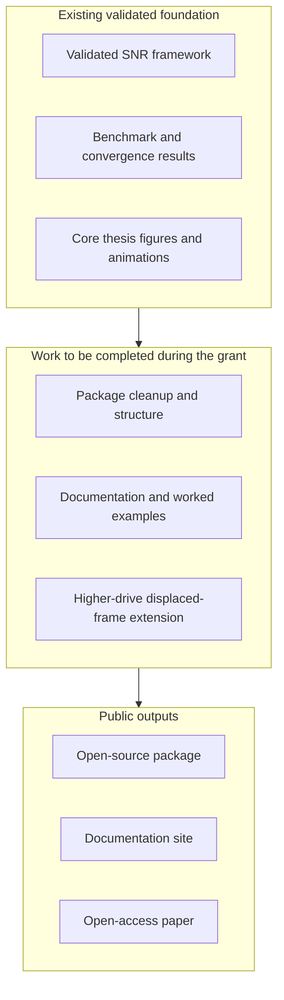
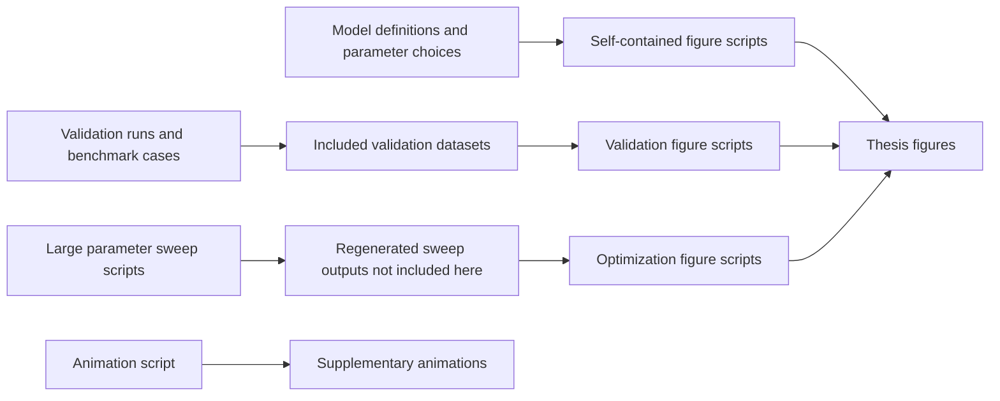

# Qubit Readout Repo

This repository is being shared with **Unitary Foundation grant reviewers** alongside a single PDF containing **Chapter 2, Chapter 3, and the relevant appendices** of my thesis.

It is a thesis companion repository, not yet the final public software package proposed in the grant. Its purpose is to show the scientific and computational foundation that already exists: the figures, scripts, selected data, and workflow behind the readout results in the thesis.

## What Is Already Here

The material collected here covers the main numerical results behind the readout chapter, including:

- benchmark checks of signal, noise, and SNR extraction against analytical, deterministic master-equation, and stochastic master-equation results
- beyond-dispersive readout results showing finite-time SNR optima and fidelity loss that do not appear in the simplest dispersive picture
- parameter studies over detuning, coupling, linewidth, drive strength, homodyne phase, and intrinsic qubit decay
- phase-space plots showing deformation of the readout states and rotation of the effective readout axis
- convergence checks for the driven Jaynes-Cummings master-equation calculations
- two supplementary animations of the cavity-field dynamics in the dispersive and full Jaynes-Cummings models

## What The Grant Would Add

What is missing at the moment is not the core physics, but the packaging and public release work. The proposed Unitary grant would support:

- turning the research code into a reusable public Python package
- writing user-facing documentation and worked examples
- making the codebase easier to install, navigate, and reuse outside the thesis context
- implementing the higher-drive displaced-frame extension described in the proposal
- preparing the software and documentation for a public release

So this repository is evidence of the work that already exists, while the grant is meant to fund the step from thesis-era research code to a public tool other researchers can use.

## Project Status Overview

The figure below is meant to separate the work that already exists from the work the grant would fund and the public outputs that would follow from it.

This repository mainly documents the first stage. The proposed grant is intended to fund the second stage and enable the third.

## Scientific Focus

The scientific focus of the repository is realistic cavity-assisted qubit readout beyond simple dispersive approximations. In particular, it documents:

- validation of SNR extraction in dispersive and driven Jaynes-Cummings benchmark regimes
- clear failure of the simplest dispersive approximation in stronger-coupling or smaller-detuning settings
- finite-time readout optimization rather than only long-time asymptotic behavior
- the role of qubit decay, drive strength, linewidth, and homodyne phase in shaping readout performance
- phase-space signatures of non-dispersive readout dynamics

## How To Read This Alongside The Thesis PDF

This repository lines up with the readout material in the accompanying thesis PDF:

- **Figures 3.1 to 3.12** in Chapter 3
- **Figure B.1** in Appendix B

Chapter 2 of the accompanying PDF provides the broader open-systems and master-equation background. The repository itself is narrower: it is centered on the readout results in Chapter 3 and the supporting convergence result in Appendix B.

The parameter sets used for the validation figures are listed in **Tables 3.1 and 3.2** of the accompanying PDF. The main optimization outcomes are summarized in **Table 3.3**.

For the exact thesis-numbered mapping from repository files to thesis figures, see [docs/thesis-figure-map.md](docs/thesis-figure-map.md).

## Technical Workflow Behind The Repository

## Repository Layout

- [`figures/chapter3/`](figures/chapter3) contains the final figure files used in Chapter 3.
- [`figures/appendix/`](figures/appendix) contains the Appendix B convergence figure.
- [`media/animations/`](media/animations) contains the two supplementary MP4 animations.
- [`scripts/animations/`](scripts/animations) contains the script that generates those two animations.
- [`scripts/direct/`](scripts/direct) contains the self-contained scripts for figures that can be regenerated directly from this repository.
- [`scripts/validation/`](scripts/validation) contains the benchmark drivers together with the postprocess scripts for the validation figures.
- [`scripts/sweeps/`](scripts/sweeps) contains the original larger sweep scripts and sanitized example Slurm launchers.
- [`scripts/postprocess/optimization/`](scripts/postprocess/optimization) contains the scripts that turn sweep outputs into the optimization figures.
- [`scripts/reference/`](scripts/reference) contains a baseline corrected-master-equation reference script.
- [`data/selected/`](data/selected) contains the compact datasets needed to regenerate the selected validation figures exactly.
- [`external_results/`](external_results) is where regenerated heavy sweep outputs would go if those scans were rerun outside this review repository.
- [`docs/`](docs) contains the figure map, reproducibility guide, and supplementary-media note.

## At A Glance: Thesis Coverage

| Thesis material | What is included here | Reproducibility |
| --- | --- | --- |
| Figures 3.1-3.2 | Dispersive-interpretation and Purcell figures, with self-contained scripts | directly reproducible here |
| Figures 3.3-3.5 | Validation and beyond-dispersive benchmark figures, with selected data and figure scripts | reproducible from included data |
| Figures 3.6-3.10 | Optimization figures, sweep scripts, and figure-generation scripts | workflow preserved; full rerun needs regenerated sweep outputs |
| Figures 3.11-3.12 | Phase-space figures, with self-contained scripts | directly reproducible here |
| Figure B.1 | Convergence figure, with self-contained script | directly reproducible here |
| Supplementary animations | Two MP4 animations plus the generator script | directly reproducible here |

## Representative Files

- [Figure 3.3a](figures/chapter3/dispersive_H_g0.20_SNR.pdf)
- [Figure 3.3b](figures/chapter3/JC_H_dispersive_g0.05_SNR.pdf)
- [Figure 3.4](figures/chapter3/JC_H_BEYOND-dispersive-with-gamma_g0.20_SNR.pdf)
- [Figure 3.6a](figures/chapter3/max_snr_heatmap.pdf)
- [Figure 3.6b](figures/chapter3/optimal_time_heatmap.pdf)
- [Figure 3.8b reviewer-facing alias](figures/chapter3/figure_3_8b_kappa_epsilon_heatmap.pdf)
- [Figure 3.11](figures/chapter3/thesis_wigner_final.pdf)
- [Supplementary animation: dispersive evolution](media/animations/dispersive_evolution.mp4)
- [Supplementary animation: full JC evolution](media/animations/full_jc_evolution.mp4)

## Reproducing The Included Results

Detailed instructions are given in [docs/reproducibility.md](docs/reproducibility.md). In short:

1. Create a Python environment close to the recorded thesis compute stack.
2. Install the required Python packages and a LaTeX distribution for figure text rendering.
3. Run the self-contained scripts in `scripts/direct/`.
4. Run the validation figure scripts in `scripts/validation/postprocess/`.
5. Run the animation script in `scripts/animations/`.
6. For the larger optimization figures, combine the preserved sweep scripts with regenerated sweep outputs if a full rerun is needed.

## What Is And Is Not Reproducible Here

This repository is meant for review and inspection, not as a full archival dump of every large parameter sweep. For that reason, the material falls into three groups:

- **Directly reproducible here**: the necessary models and plotting scripts are included directly.
- **Reproducible from included data**: the compact input data and the figure-generation scripts are both included.
- **Workflow preserved; full rerun needs regenerated sweep outputs**: the final figure, the sweep script, and the figure-generation script are included, but the large saved sweep outputs are not.

Figures **3.6 to 3.10** belong to the third group. The repository keeps the workflow visible, but not the bulky `.npz` outputs from the original scans.

## Supplementary Animations

The repository also includes two MP4 files that are not part of the thesis figure set:

- `dispersive_evolution.mp4`
- `full_jc_evolution.mp4`

They are included because they make the readout dynamics easier to inspect visually during review. Details are given in [docs/supplementary-media.md](docs/supplementary-media.md).

## Quick Links

- [Thesis figure map](docs/thesis-figure-map.md)
- [Reproducibility guide](docs/reproducibility.md)
- [Supplementary media](docs/supplementary-media.md)
